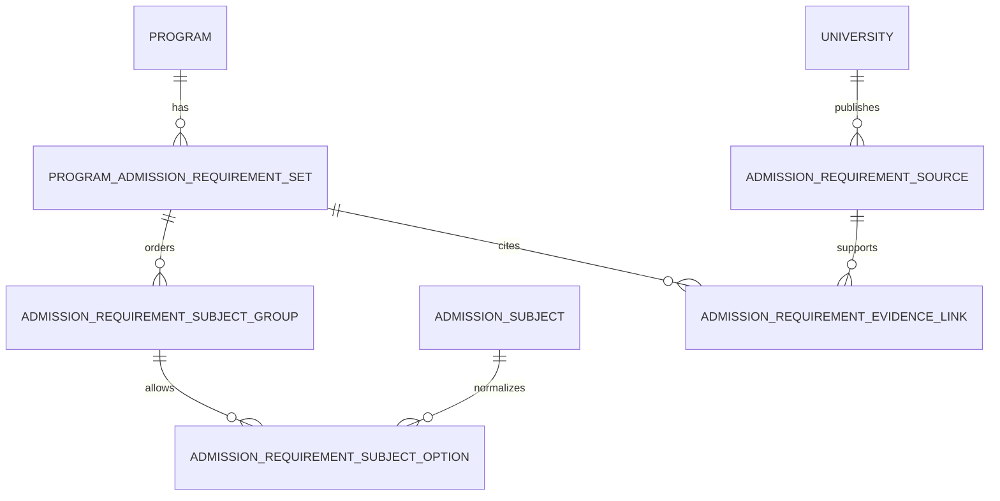

# Нормализованная схема вступительных требований

Milestone `M-ADMISSION-SUBJECTS-SCHEMA-01` добавляет только пустую,
университет-независимую схему. Миграция
`0007_admission_requirements_schema` не читает audit JSON, не выполняет
backfill и не меняет существующие `Program`, `ProgramOffering`, snapshot или
profile rows.

## Связи сущностей

- `admission_subjects` хранит один стабильный ключ и официальные русскую и
  опциональную белорусскую подписи предмета.
- `admission_requirement_sources` хранит версионированное официальное
  доказательство для конкретного University. Это не runtime `DataSource`:
  health, retry, ETag и adapter state сюда не смешиваются.
- `program_admission_requirement_sets` хранит отдельный набор для одного
  Program, года и pathway. Код pathway остаётся расширяемой строкой, а
  source-defined подпись хранится отдельно.
- `admission_requirement_subject_groups` задаёт стабильную позицию,
  `choose_count`, generic assessment kind и необязательную официальную подпись
  испытания.
- `admission_requirement_subject_options` связывает группу с нормализованными
  предметами и фиксирует детерминированный порядок вариантов.
- `admission_requirement_evidence_links` связывает набор с одним или
  несколькими официальными источниками и допускает locator/note для конкретного
  требования.

## Applicability и альтернативы

Требования принадлежат pathway-specific set, а не непосредственно Program.
Так полный срок, сокращённый срок и целевая подготовка не становятся одним
универсальным списком. Set сохраняет год, форму и подробную подпись формы,
применимость финансирования, базу образования, track/applicability note и
проверочные timestamps.

Set не обязан ссылаться на `ProgramOffering`: официальный pathway может
охватывать форму, трек или условие, для которого нет ровно одного существующего
Offering. Это исключает выдуманные связи с 57 reference-only Offerings.

Одна обязательная позиция — группа с `choose_count = 1` и одним option. Выбор
языка или варианта истории — группа с `choose_count = 1` и несколькими
упорядоченными options. Будущий выбор нескольких предметов использует
`choose_count > 1`. Межстрочное условие `choose_count <= option_count`
проверяет reusable helper будущего importer/service; SQLite trigger намеренно
не добавляется.

`assessment_kind` содержит только generic семантику:
`external_standardized`, `internal_written_examination`,
`internal_oral_examination` или `other`. Официальная формулировка вроде
`ЦЭ/ЦТ` хранится независимо в `official_assessment_label`.

Tracked audit содержит восемь повторно используемых requirement definitions,
которые разворачиваются в 11 уникальных subject keys. Это разные показатели:
варианты истории и предметы внутренних экзаменов не объединяются ради
искусственного уменьшения числа Subjects.

## Provenance и удаление

Source key уникален внутри University; requirement-set key — внутри Program и
admission year. Один source связывается с одним set только один раз.

- Program и University нельзя удалить, пока на них ссылаются requirements или
  evidence sources.
- Subject и evidence source нельзя удалить, пока они используются.
- Удаление requirement set каскадно удаляет только его groups, options и
  evidence links.
- Удаление group каскадно удаляет только её options.
- Downgrade сначала проверяет все шесть новых таблиц и отказывается продолжать,
  если хотя бы в одной есть строки.

Legacy nullable `Program.admission_subjects_json` продолжает существовать без
переименования, backfill или новой интерпретации. Нормализованные данные с ним
не смешиваются.

## Следующий milestone

`M-BSEU-ADMISSION-SUBJECTS-IMPORT-01`: отдельный идемпотентный fail-closed
importer audit JSON с обязательным dry-run. До этого milestone схема остаётся
пустой и публичные API её не используют.
