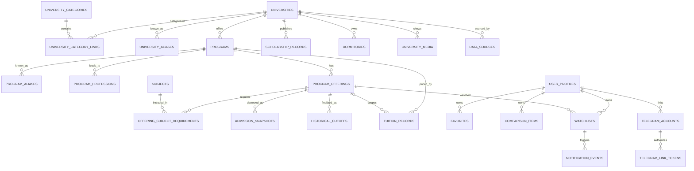

# Целевая модель данных и план миграции SQLite

## Scope and invariants

This document designs future SQLAlchemy/Alembic work. No model, migration or database change is performed in the architecture milestone.

Hard invariants:

- existing `specialties`, `admission_snapshots`, `scraper_runs`, `notification_logs` and `http_cache_state` rows are retained;
- BSEU monitoring and old IDs/API remain valid through compatibility mapping;
- no legacy table is dropped or renamed in migrations A–E;
- current observations are never promoted to official historical cutoffs;
- unknown facts remain nullable plus availability/provenance, never fabricated zero/false values;
- all SQLite table rebuilds require backup, foreign-key verification and rollback rehearsal.

## Shared conventions

- Internal primary keys are `INTEGER PRIMARY KEY` for efficient SQLite joins.
- User-facing mutable entities also have immutable `public_id` UUID text (`CHAR(36)` initially), unique and indexed. Public APIs should prefer it for profiles/watchlists/tokens; catalog may use stable code/slug.
- Timestamps are UTC application timestamps. SQLAlchemy timezone-aware values must be normalized explicitly because SQLite stores text values. Every mutable entity has `created_at` and `updated_at`; observations additionally have domain times.
- Machine enums are lowercase ASCII strings with application validation and database `CHECK` constraints where Alembic/SQLite safely supports them. Russian labels live in API/frontend mappings.
- Foreign keys are enabled on every connection. Ownership children use `ON DELETE CASCADE`; facts that must survive entity retirement use `RESTRICT`; optional source references use `SET NULL` only when record-level URL remains available.
- Money uses integer minor units (`amount_minor`) and ISO currency (`BYN`), never floating point.
- JSON is used only for bounded source payload fragments/score distribution/preferences; identity and filter dimensions remain relational.

## Entity relationship overview



## Catalog tables

### `universities`

- **PK:** `id` integer.
- **Identity:** `code` and `slug` non-null; `UNIQUE(code)`, `UNIQUE(slug)`. `code` is stable integration identity (`bseu`); slug is stable public URL identity (`bseu`) and is not derived on every rename.
- **Fields:** `short_name`, `full_name`, `institution_kind`, `ownership_type`, `city`, `region`, `official_site_url`, `admissions_url`, nullable `description`, `monitoring_status`, `active`.
- **Provenance:** non-null `source_url`, `source_checked_at`; nullable `data_verified_at`; optional `data_source_id` FK after sources exist. The record remains usable if the source row is retired.
- **Timestamps:** `created_at`, `updated_at` non-null.
- **Enums:** institution kind, ownership type, monitoring status.
- **Indexes:** active/name, normalized short/full name, city, region, `(monitoring_status, active)`.
- **Delete:** `RESTRICT` while programs/sources/facts exist; normal removal is `active=false`.
- **Source:** Ministry registry plus official university site according to `docs/universities-source-audit.md`.

### `university_categories`

- **PK:** `id`; non-null stable `code`, `slug`, `name`, normalized name; optional `description`.
- **Unique:** code and slug separately.
- **Timestamps:** created/updated.
- **Indexes:** normalized name.
- **Source:** curated taxonomy; `source_url`/checked time nullable only for explicitly editorial category definitions, with `verification_method=editorial_policy`.

### `university_category_links`

- **PK:** composite `(university_id, category_id)` or integer PK plus equivalent unique constraint; prefer composite because link has no public identity.
- **FKs:** university/category non-null, both `ON DELETE CASCADE`.
- **Fields:** `source_url`, `checked_at`, verification method, created time.
- **Indexes:** reverse `(category_id, university_id)`.
- **Source:** official description or documented editorial classification; provenance required.

### `university_aliases`

- **PK:** `id`; non-null FK `university_id` → universities, `ON DELETE CASCADE`.
- **Fields:** alias, normalized alias, alias type (`former_name`, `abbreviation`, `alternate_spelling`), active.
- **Unique:** `(university_id, normalized_alias)`; a service-level collision check prevents one active alias from ambiguously resolving to different universities.
- **Provenance/timestamps:** source URL, checked/verified time, created/updated; historical names require the dedicated legal/history check called out in the source audit.
- **Indexes:** normalized alias and university/type.
- **Source:** official registry/site or explicitly verified historical record; unaudited review items are not imported as searchable aliases.

### `programs`

- **PK:** `id` integer.
- **FK:** `university_id` non-null → universities, `ON DELETE RESTRICT`.
- **Fields:** nullable official `external_code`, non-null `name`, `normalized_name`, nullable qualification/description; `active`; optional normalized search text.
- **Unique:** `(university_id, external_code)` where external code is not null; fallback dedup key `(university_id, normalized_name)` enforced by service and a unique constraint only after collision audit.
- **Provenance:** `source_url`, `source_checked_at`, nullable `source_updated_at`, `data_verified_at`, `data_source_id`.
- **Timestamps:** created/updated.
- **Indexes:** university/active/name, normalized name, external code.
- **Delete:** restricted by offerings/facts; deactivate instead.
- **Source:** official program catalog.

### `program_aliases`

- **PK/FK/delete:** integer `id`; non-null program FK `ON DELETE CASCADE`.
- **Fields/nullability:** non-null alias, normalized alias and alias type; optional notes; active non-null.
- **Unique/enums:** unique `(program_id, normalized_alias)`; alias type uses the same stable machine-value policy as university aliases.
- **Provenance/timestamps:** source URL, checked/verified time, confidence and created/updated are required as applicable.
- **Indexes/source:** normalized-alias and program/type indexes; official catalog or verified historical source.

### `subjects`

- **PK/FK:** integer `id`; no parent FK.
- **Fields/nullability:** stable code, slug, Russian label and normalized label non-null; optional description; active non-null.
- **Unique/enums:** code and slug separately unique; no display string is an enum/key.
- **Provenance/timestamps:** official admissions-rule/taxonomy URL, checked/verified time, created/updated.
- **Indexes/delete/source:** normalized-label index; deletion restricted while requirements refer to it; curated canonical reference backed by official admissions rules.

### `offering_subject_requirements`

- **PK/FKs/delete:** composite `(program_offering_id, subject_id, requirement_group)`; both FKs non-null and `ON DELETE CASCADE` from the owning offering/subject.
- **Fields/nullability:** optional priority and notes; requirement group non-null. Admission year/form/funding are inherited from the offering.
- **Unique/enums:** composite PK is the uniqueness rule; group is a stable machine code, not a Russian label.
- **Provenance/timestamps:** source URL/check/update/verify time and created/updated required; confidence non-null.
- **Indexes/source:** reverse `(subject_id, program_offering_id)` index; official offering admission requirements. Unknown subjects do not create empty rows.

### `program_professions`

- **PK/FK/delete:** integer `id`; program FK non-null `ON DELETE CASCADE`.
- **Fields/nullability:** profession label and normalized label non-null; official classification code/description nullable; active non-null.
- **Unique/enums:** unique `(program_id, normalized_label)`; no enum is needed.
- **Provenance/timestamps:** source URL/check/verify time, confidence and created/updated.
- **Indexes/source:** normalized label and classification code indexes; official program/qualification description. Unverified marketing terms are not imported.

### `program_offerings`

- **PK:** `id` integer.
- **FK:** `program_id` non-null → programs, `ON DELETE RESTRICT`.
- **Dimensions:** `admission_year`, `study_form`, `funding_type`, optional official `external_offering_code`.
- **Facts:** nullable `places`, `application_deadline_at`; non-null `monitoring_status`, `official_url`, availability state; optional source/data-source fields.
- **Unique:** `(program_id, admission_year, study_form, funding_type)`; if an official source contains distinguishable tracks with the same tuple, add audited `track_code` before import, never silently merge.
- **Timestamps/provenance:** checked/source-updated/verified plus created/updated.
- **Indexes:** `(admission_year, monitoring_status)`, `(program_id, admission_year)`, `(study_form, funding_type, admission_year)`.
- **Delete:** restricted by snapshots/cutoffs/watchlists; deactivate/close instead.
- **Source:** official admission plan/current campaign source.

## Monitoring and historical facts

### `admission_snapshots` (canonical extension of current table)

- **PK:** preserve existing integer `id` values.
- **FKs:** existing nullable-during-backfill `specialty_id` remains; add nullable `program_offering_id` → offerings with `ON DELETE RESTRICT`, then make it logically required for canonical rows after verification. Never drop `specialty_id` before migration F.
- **Observation fields:** preserve `fetched_at`, `source_updated_at`, `admission_plan`, `applications_total`, `competition`, cutoff range, distribution JSON and `raw_data_hash`. Add `checked_at` only if source check must be attached per snapshot; `data_source_id`, `calculation_version`, availability/confidence.
- **User scenario:** preserve legacy `user_score`, `estimated_user_position`, `user_status` for old rows/API, but new canonical snapshots do not depend on a global user. Per-user calculations happen at read time or in profile-scoped results.
- **Unique/dedup:** unique candidate `(program_offering_id, raw_data_hash, calculation_version)` after backfill audit. Existing behavior compares the latest hash; preserve raw hash bytes exactly.
- **Indexes:** existing fetched/hash/specialty indexes; add `(program_offering_id, fetched_at DESC)` and `(program_offering_id, raw_data_hash)`.
- **Timestamps:** `fetched_at` is snapshot/observation time, not HTTP checked time or source update time.
- **Source:** official current-applications source via data source/run.
- **Delete:** offering restricted; data source may be `SET NULL` only if snapshot source URL/hash remain.

### `historical_cutoffs`

- **PK:** `id`; **FK:** `program_offering_id` non-null, `ON DELETE RESTRICT`.
- **Fields:** official cutoff `score_min`, nullable `score_max` only if official source publishes range, admission year duplicated only if constrained equal through service, optional notes/category.
- **Unique:** `(program_offering_id, cutoff_category)` where category defaults `general`; audited additional dimensions get stable codes.
- **Enums:** funding/form remain on offering; cutoff category machine value.
- **Provenance/timestamps:** official source URL, source/check/update/verified times, confidence, created/updated.
- **Indexes:** offering, `(admission_year, score_min)` if year is materialized.
- **Source:** official final admissions results only. A current estimated cutoff is never inserted here.

### `data_sources`

- **PK:** `id`; optional FK `university_id` → universities `ON DELETE RESTRICT`.
- **Identity:** non-null `code`, `url`, `source_type`, capability; `UNIQUE(code)`, optional unique `(university_id, capability, url)`.
- **HTTP state:** nullable ETag/Last-Modified/content hash; `checked_at`, nullable `source_updated_at`, last success/error times, sanitised error code, consecutive errors.
- **Status:** source health, active, schema/adapter version, verification method/confidence.
- **Timestamps:** created/updated/verified.
- **Indexes:** `(university_id, capability, active)`, `(health, checked_at)`.
- **Source:** seeded only from audited official URLs. Existing `http_cache_state` maps to the BSEU admissions source; no secret-bearing URL is permitted.

### `scraper_runs` (retained and extended)

- **PK:** preserve IDs. Add nullable `data_source_id` and optional `adapter_version`; keep current columns/status/content hash.
- **Indexes:** current started/status plus `(data_source_id, started_at DESC)`.
- **Delete:** source `SET NULL`; run audit trail remains.
- **Mapping:** all current rows link to BSEU admission XML source during migration C.

## Finance, scholarship, dormitory and media

### `tuition_records`

- **PK:** `id`; non-null `program_id`; nullable `program_offering_id` when price is not campaign-specific.
- **Scope:** `academic_year`, nullable `course_number`, nullable semester/period, `amount_minor`, `currency`, optional conditions.
- **Nullability:** amount may be null only with availability `unknown/partial`; currency required when amount present.
- **Unique:** `(program_id, program_offering_id, academic_year, course_number, period_code, source_url)` with normalized sentinel strategy for SQLite nullable uniqueness, or a service-enforced canonical key plus partial unique indexes.
- **Provenance/timestamps:** source/check/update/verified, validity from/to, created/updated, confidence.
- **Indexes:** program/year, offering/year, `(currency, amount_minor)` for max-tuition filters.
- **Delete:** program/offering restricted.
- **Source:** official tuition page/order/document.

### `scholarship_records`

- **PK:** `id`; FK `university_id` non-null, optional program FK.
- **Fields:** scholarship type, title, nullable amount min/max, currency, eligibility/conditions, validity dates, availability.
- **Unique:** university/type/title/valid-from/source URL normalized key.
- **Provenance/timestamps/indexes:** standard provenance; university/type and validity indexes.
- **Delete:** university/program restricted.
- **Source:** official scholarship regulation/page.

### `dormitories`

- **PK:** `id`; FK university non-null.
- **Fields:** stable local code nullable, name, nullable address/capacity, availability statement/state, eligibility/conditions, active.
- **Unique:** `(university_id, code)` when code exists; fallback `(university_id, normalized_name)` after audit.
- **Provenance/timestamps/indexes:** standard provenance; university/active; city/address search optional.
- **Delete:** university restricted; deactivate instead.
- **Source:** official dormitory/campus page. Missing information never creates a negative fact.

### `university_media`

- **PK:** `id`; FK university non-null.
- **Fields:** media type, asset URL, source page URL, optional alt/caption/attribution/license, checksum, sort order, active.
- **Unique:** `(university_id, asset_url)`.
- **Provenance/timestamps/indexes:** checked/verified, created/updated; `(university_id, media_type, active, sort_order)`.
- **Delete:** cascade when university is physically deleted (normally restricted by other facts).
- **Source:** official university assets/pages with documented origin.

## User and notification tables

### `user_profiles`

- **PK:** integer `id`; immutable unique `public_id` UUID; nullable future account FK not added in first release.
- **Fields:** admission status, preferences JSON with schema version, optional locale/timezone, active.
- **Timestamps:** created/updated/last_seen; optional expires-at for abandoned anonymous profiles.
- **Indexes:** public ID, active/last-seen, expiry cleanup.
- **Source:** user-provided; no official-source provenance fields.
- **Delete:** cascades profile-owned favorites/comparison/watchlists/tokens; notification audit may pseudonymize rather than cascade according to retention policy.

### `favorites`

- **PK:** `id`; FK profile non-null `CASCADE`.
- **Polymorphic target:** exactly one of nullable `university_id`, `program_id`, `program_offering_id` must be set, enforced by `CHECK`.
- **Unique:** one favorite per profile/target using three partial unique indexes.
- **Fields/timestamps:** created_at, optional note; no fake target string.
- **Indexes/delete:** target indexes; target delete restricted while favorite exists or cleaned explicitly.
- **Source:** user action.

### `comparison_items`

- Created only if cross-device/server synchronization proves necessary; local compare remains sufficient earlier.
- **PK/FK/target:** same exactly-one target model as favorites; profile `CASCADE`.
- **Fields:** position, created/updated; optional comparison set key later.
- **Unique/indexes:** profile/target partial uniques and `(profile_id, position)` unique.
- **Source:** user action.

### `telegram_accounts`

- **PK:** `id`, unique public ID; FK profile non-null `CASCADE`.
- **Fields:** encrypted-at-rest or otherwise protected Telegram user/chat identifier according to threat model, optional username/display metadata, verified/disabled timestamps, delivery enabled. Bot token is never stored here.
- **Unique:** Telegram platform identity unique; one active account per profile initially may be service policy.
- **Indexes:** profile/active, Telegram identity hash.
- **Source:** verified Telegram callback/user action.

### `telegram_link_tokens`

- **PK:** `id`, public ID; FK profile non-null `CASCADE`, optional linked account `SET NULL`.
- **Fields:** token hash only, expires_at, consumed_at, created_at, attempt count; raw token never persisted/logged.
- **Unique/indexes:** token hash unique; expiry/consumed cleanup index.
- **Delete:** profile cascade; short retention after consumption.
- **Source:** application-generated security credential.

### `watchlists`

- **PK:** `id`, unique public ID; FK profile `CASCADE`, offering `RESTRICT`.
- **Fields:** active, event filters/thresholds JSON with schema version, notification channel, last-evaluated timestamp.
- **Unique:** `(profile_id, program_offering_id)` for first release.
- **Enums:** delivery channel and optional risk/event settings.
- **Indexes:** `(program_offering_id, active)`, profile/active.
- **Source:** user action.

### `notification_events`

- **PK:** `id`, unique public ID; optional watchlist FK `SET NULL`; profile/account FKs handled per retention policy; offering/source run references nullable.
- **Fields:** event type, stable fingerprint, payload JSON without secrets, created time, delivery status, attempted/sent/failed timestamps, attempts, sanitised error code.
- **Unique:** fingerprint per destination/channel, e.g. `(telegram_account_id, fingerprint)`; owner-mode legacy fingerprints map separately to avoid changing existing semantics.
- **Indexes:** pending delivery `(delivery_status, created_at)`, watchlist/time, offering/type/time.
- **Source:** service-derived from accepted snapshots; records provenance IDs/freshness in payload.
- **Delete:** source domain entities restricted or references set null; delivery audit retained per policy.

Legacy `notification_logs` remains unchanged through migration E. Migration logic can mirror or map its fingerprints but must not resend old messages.

## ID, code and slug strategy

- Integer IDs are internal and never derived from names.
- University `code` is short, lowercase ASCII, audited and immutable (`bseu`). Adapter registry and imports use it.
- University slug is lowercase ASCII with hyphens, unique and stable. A legal/display-name change updates names and aliases, not code/slug. A deliberate slug change requires a `university_slug_redirects(old_slug UNIQUE, university_id)` compatibility table in the milestone that needs it.
- Program IDs remain stable across display-name changes; external official codes are retained. When no official code exists, dedup uses university + normalized name plus manual review for collisions.
- Offering identity is program + year + form + funding + optional audited track. A new year creates a new row.
- User-owned records expose public UUIDs; raw sequential profile/watchlist/token IDs do not leave the API.
- Imports use upsert by stable code/external identity and reject ambiguous duplicates. Display names are attributes, never keys.

## Enum strategy

| Domain | Machine value → Russian UI label |
|---|---|
| Institution kind | `university` → «университет»; `academy` → «академия»; `institute` → «институт»; `military_academy` → «военная академия»; `branch` → «филиал»; `other` → «другое» |
| Ownership type | `state` → «государственный»; `private` → «частный»; `mixed` → «смешанная форма»; `unknown` → «уточняется» |
| Monitoring status | `online` → «мониторинг работает»; `candidate` → «кандидат на подключение»; `reference_only` → «только справочные данные»; `needs_research` → «требует исследования»; `disabled` → «отключён» |
| Study form | `full_time` → «дневная»; `part_time` → «заочная»; `part_time_shortened` → «заочная сокращённая»; `distance` → «дистанционная»; `evening` → «вечерняя»; `other` → «другая» |
| Funding type | `state_funded` → «бюджет»; `tuition_paid` → «платная»; `targeted` → «целевое обучение»; `other` → «другое» |
| Source health | `healthy` → «доступен»; `degraded` → «частично доступен»; `unavailable` → «недоступен»; `schema_changed` → «источник изменился»; `disabled` → «отключён»; `needs_review` → «нужна проверка» |
| Media type | `logo` → «логотип»; `campus` → «кампус»; `building` → «корпус»; `dormitory` → «общежитие»; `gallery` → «фотография»; `video` → «видео» |
| Scholarship type | `academic` → «учебная»; `social` → «социальная»; `presidential` → «президентская»; `named` → «именная»; `university` → «стипендия вуза»; `other` → «другая» |
| Notification event | `applications_changed` → «изменилось число заявлений»; `competition_started` → «начался конкурс»; `cutoff_range_changed` → «изменился предполагаемый диапазон»; `source_outage` → «источник недоступен»; `source_recovered` → «источник восстановлен»; `deadline_soon` → «скоро срок подачи» |
| Delivery status | `pending` → «ожидает»; `sending` → «отправляется»; `sent` → «отправлено»; `failed_retryable` → «ошибка, будет повтор»; `failed_final` → «не доставлено»; `skipped_duplicate` → «дубликат пропущен» |
| User admission status | `exploring` → «выбираю варианты»; `preparing` → «готовлюсь»; `applying` → «подаю документы»; `submitted` → «документы поданы»; `enrolled` → «зачислен»; `unknown` → «не указано» |

Persisted Russian strings in current legacy rows are preserved. Migration C maps them to machine enums on canonical offerings but does not rewrite legacy values.

## Existing BSEU data mapping

### Current facts

`backend/app/models.py` defines the five legacy tables. The project DB currently has one `specialties` row, two `admission_snapshots`, scraper run history, HTTP cache state and no sent notification row. Row counts are verification inputs, not migration constants.

### Canonical records

No current table "becomes" `universities`: the legacy schema has no university entity. Migration B creates a new `universities` table, while migration C inserts BSEU and maps legacy `specialties` to canonical programs/offerings.

1. Insert `universities`: code/slug `bseu`, current official names from the audited canonical dataset, institution `university`, ownership `state`, city/region Minsk, `monitoring_status=online`, official/admissions URLs and audit provenance.
2. Insert one `programs` record for «Экономическая информатика». Preserve current display/normalized strings as aliases/mapping evidence if encoding audit reveals legacy representation differences.
3. Insert the configured offering for the applicable admission year, `full_time + tuition_paid`. Admission year is an explicit migration parameter verified against source/snapshot dates; it must not be guessed silently. Plan comes from current accepted source data.
4. Add `program_offering_id` to each legacy snapshot by joining through a mapping table, not by name at every read.

### Mapping tables and preserved IDs

Create `legacy_specialty_mappings` in migration C:

- `legacy_specialty_id` PK/FK → `specialties.id` (`RESTRICT`);
- `program_id` and `program_offering_id` FKs (`RESTRICT`);
- `mapping_version`, `mapped_at`, `verified_at`, `notes` nullable;
- unique `program_offering_id` only after confirming one-to-one for current data.

Existing `specialties.id`, `admission_snapshots.id`, `scraper_runs.id`, `notification_logs.id` and `http_cache_state.url` remain unchanged. New canonical IDs need not numerically equal legacy IDs; mapping is explicit. No table copy may reset IDs.

### Field preservation

- Snapshot `raw_data_hash`, distribution JSON, calculations, `fetched_at` and `source_updated_at` are copied byte/value-for-value or retained in-place; a verification query compares every ID/hash/time.
- Existing scraper runs retain IDs, started/finished times, statuses, HTTP/errors, rows and content hashes; add BSEU `data_source_id` by backfill.
- Existing `http_cache_state` ETag, Last-Modified and checked time initialize BSEU `data_sources` conditional state; legacy row remains authoritative until adapter cutover.
- Existing notification fingerprints, sent times and messages remain in `notification_logs`. If mirrored into `notification_events`, use a deterministic `legacy:<id>` mapping and `sent` status; never resend.
- Current user score/status remain on old snapshots for old API parity. They are not canonical official facts and are not used to seed user profiles.

### Temporary legacy ownership

Through migration C and BSEU adapter extraction, legacy tables remain write targets for the current scraper. Canonical catalog records and mapping are additive. During a later controlled cutover, either dual-write with tests or canonical-write plus compatibility read is selected in one milestone; silent mixed ownership is forbidden.

## Alembic strategy

Alembic revisions are small and reversible. Each production upgrade requires an online SQLite backup while service is stopped for schema/backfill migrations, disk-space check, application version compatibility check and recorded row counts.

### Migration A — Alembic bootstrap and baseline

- **Upgrade:** add Alembic dependency/config; introspect exact legacy schema; create/stamp `alembic_version` without recreating existing tables. If a baseline revision contains table definitions for fresh installs, existing production is stamped only after schema fingerprint verification.
- **Downgrade:** remove version stamp/config only in a controlled dev copy; never drop legacy tables.
- **Verification:** compare `sqlite_master`, `PRAGMA table_info/index_list/foreign_key_list`, row counts and `PRAGMA foreign_key_check`; run old API and `check.ps1`.
- **Risk:** stamping a database that differs from expected schema.
- **Rollback condition:** any schema fingerprint mismatch, missing table/index, changed row count or failed old endpoint. Restore backup/application checkpoint and leave DB unstamped.

### Migration B — catalog schema

- **Upgrade:** create universities, aliases, categories/link, programs, subjects/professions, offerings and record-level provenance columns; `data_sources` is deferred to D. Do not move or alter snapshots beyond safe additive structures agreed in revision.
- **Downgrade:** drop only new empty catalog tables in reverse FK order. Refuse automatic downgrade if they contain non-seed/user data unless explicit export/confirmation exists.
- **Verification:** tables/constraints/indexes, seed-free row counts, foreign-key check, fresh-database upgrade and legacy API parity.
- **Risk:** SQLite enum/check/index incompatibility or accidental name collision with legacy `specialties`.
- **Rollback condition:** constraint/index creation failure, legacy write regression, non-empty unintended tables or check failure.

### Migration C — BSEU canonical identity and snapshot links

- **Upgrade:** insert deterministic BSEU university/program/offering; create legacy mapping; add nullable snapshot/source-run FKs; backfill in one verified transaction/batches; retain all legacy columns/tables.
- **Downgrade:** clear only backfilled canonical FKs/mappings and delete canonical BSEU seed rows if no newer references exist; never delete legacy rows. If newer references exist, downgrade stops with guidance.
- **Verification:** one mapping per active legacy specialty; zero unmapped snapshots; exact counts, IDs, hashes, JSON and timestamps; source-run count match; duplicate check; compatibility API JSON comparison.
- **Risk:** wrong admission year/form/funding mapping, encoding mismatch or timestamp conversion.
- **Rollback condition:** any ambiguous specialty, differing payload/hash/time, orphan, duplicate offering or endpoint difference. Roll back transaction/restore backup.

### Migration D — finance, dormitory, media and source provenance

- **Upgrade:** create tuition, scholarship, dormitory, media and full data-source structures/indexes; migrate BSEU cache/run linkage if not done in C. No speculative facts are seeded.
- **Downgrade:** remove new empty tables and optional FKs only after exporting/confirming no accepted facts; retain legacy cache/run data.
- **Verification:** constraints for nullable unknowns/money, exact BSEU cache validators, run linkage counts, provenance-required checks and FK check.
- **Risk:** losing conditional validators or accidentally treating missing facts as negative/zero.
- **Rollback condition:** validator mismatch, missing provenance, invalid money record or monitoring regression.

### Migration E — profiles, favorites, compare, watchlists and Telegram linking

- **Upgrade:** create user-owned and notification tables; optionally mirror legacy notification logs as already-sent compatibility events with deterministic mappings. Existing owner settings remain unchanged.
- **Downgrade:** permitted automatically only when no profiles/links/watchlists exist. Otherwise export/preserve user data and abort destructive downgrade; owner mode remains available.
- **Verification:** UUID uniqueness, exactly-one favorite/comparison target checks, token hashing/expiry, profile cascades on disposable test DB, no raw token/chat ID in logs/API, fingerprint dedup tests.
- **Risk:** privacy/security defect or duplicate Telegram delivery.
- **Rollback condition:** raw token persistence, broken dedup, orphaned profile data, owner notification regression or non-reversible user data without export.

### Migration F — compatibility cleanup after confirmation

- **Upgrade:** only after at least one verified full admission cycle and explicit approval: remove obsolete dual-write/mapping columns or legacy tables whose consumers are gone. Usually split this phase into several revisions rather than one destructive revision.
- **Downgrade:** restore compatibility schema from pre-migration backup/export and deploy prior application; destructive drops require archival copy and documented restore script.
- **Verification:** no code/scripts/dashboard reference legacy schema/endpoints scheduled for removal; archived row counts/checksums; new API parity and production health.
- **Risk:** irreversible loss of audit/history or hidden consumer breakage.
- **Rollback condition:** any active legacy consumer, checksum mismatch, incomplete archive, failed full-cycle acceptance or absent operator approval.

Six migration phases are planned (A–F), but each phase may contain multiple Alembic revisions when SQLite rebuild risk or data backfill size warrants it. They must not be collapsed into one migration.

## Verification queries (templates)

Exact SQL is finalized against migration symbols, but every upgrade includes equivalents of:

```sql
PRAGMA foreign_keys = ON;
PRAGMA foreign_key_check;
PRAGMA integrity_check;

SELECT COUNT(*) FROM specialties;
SELECT COUNT(*) FROM admission_snapshots;
SELECT COUNT(*) FROM scraper_runs;
SELECT COUNT(*) FROM notification_logs;

SELECT COUNT(*)
FROM admission_snapshots s
LEFT JOIN legacy_specialty_mappings m ON m.legacy_specialty_id = s.specialty_id
WHERE m.program_offering_id IS NULL;

SELECT id, raw_data_hash, fetched_at, source_updated_at
FROM admission_snapshots
ORDER BY id;
```

Before/after outputs are captured without secrets. Production backup checksums and DB files are never committed.

## Cutover gates

Alembic milestone may start only after:

- a clean Git tree and successful current `check.ps1`;
- a tested backup/restore command for local copy and documented production stop/backup procedure;
- explicit current-schema fingerprint in tests;
- decision on admission year for current BSEU rows from official/source evidence;
- sufficient free disk for SQLite backup and any table rebuild;
- application revision that can run both before and after each additive migration.

Adapter or frontend milestones must not be bundled into the Alembic bootstrap milestone.
