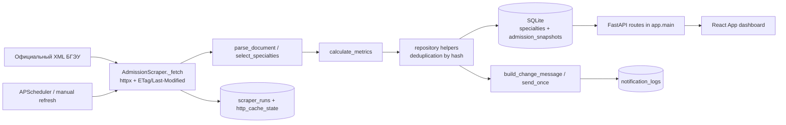
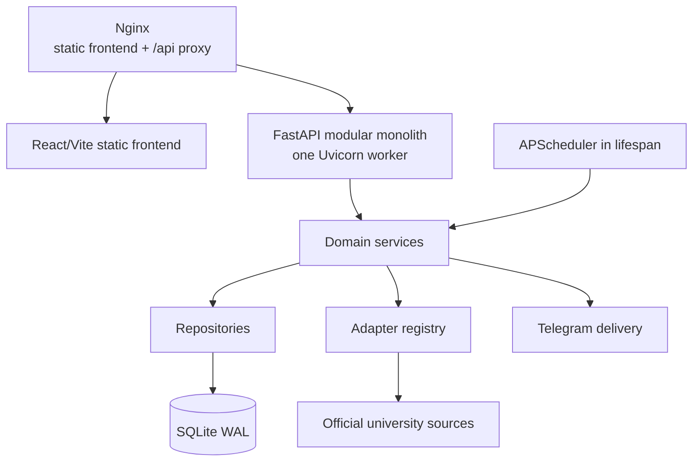

# Целевая архитектура платформы «Куда поступать»

## Статус документа

Документ фиксирует архитектурную цель и безопасную границу преобразования работающего BSEU admission monitor. Это проектирование, а не разрешение на реализацию. Порядок реализации задаёт [roadmap](roadmap.md), схема данных и backfill — [план миграций](database-migration-plan.md), интеграционный интерфейс — [контракт адаптера](adapter-contract.md).

Ограничение первого релиза: один модульный FastAPI-монолит, SQLAlchemy, SQLite, APScheduler, один Uvicorn worker, статический React frontend, Nginx и systemd на Ubuntu 24.04. Redis, PostgreSQL, Elasticsearch, очереди, микросервисы и постоянный Playwright не входят в архитектуру.

## Current architecture

### Реальные компоненты и символы

| Область | Файл и символ | Фактическая ответственность |
|---|---|---|
| FastAPI entry point | `backend/app/main.py`: `app` | Создаёт FastAPI, CORS и все семь текущих `/api/*` endpoints. Development и production запускают `app.main:app`. |
| Lifecycle | `backend/app/main.py`: `lifespan` | Вызывает `init_db()`, регистрирует interval job, запускает scheduler и фоновый initial refresh; при shutdown отменяет initial task и останавливает scheduler. |
| Scheduler | `backend/app/main.py`: `scheduler`, `scheduled_refresh` | Глобальный `AsyncIOScheduler`; job `admission-refresh`, `max_instances=1`, `coalesce=True`, интервал из settings. |
| Конфигурация | `backend/app/config.py`: `Settings`, `get_settings` | Читает `../.env`, валидирует Telegram и параметры источника, строит XML URL и CORS origins. |
| SQLAlchemy | `backend/app/database.py`: `engine`, `SessionLocal`, `init_db`, `get_db` | Создаёт engine/session; для SQLite включает WAL, foreign keys и timeout. Пока применяет `Base.metadata.create_all`, Alembic ещё не подключён. |
| Persisted schema | `backend/app/models.py` | `Specialty`, `AdmissionSnapshot`, `ScraperRun`, `NotificationLog`, `HttpCacheState`. |
| HTTP и orchestration | `backend/app/scraper.py`: `AdmissionScraper._fetch`, `AdmissionScraper.refresh` | Делает retry/conditional GET, обрабатывает 304, создаёт scraper run, вызывает parser/calculations/repository, затем Telegram. `asyncio.Lock` и пятиминутный лимит защищают источник. |
| Parser | `backend/app/parser.py`: `parse_document`, `_parse_xml`, `_parse_html`, `select_specialties` | Fail-closed распознаёт XML/HTML, требует конкурсную схему и диапазоны `G_*`, нормализует форму/основу и выбирает настроенные специальности. |
| Расчёты | `backend/app/calculations.py`: `calculate_metrics` | Рассчитывает конкурс, диапазон предполагаемого порога, примерное место и статус без выдумывания точного балла внутри диапазона. |
| Repository helpers | `backend/app/repository.py` | Создаёт legacy `Specialty`, дедуплицирует snapshots по `normalized_snapshot_hash`, читает последний snapshot и сериализует ответ. Это набор функций, а не отдельный repository layer. |
| Telegram | `backend/app/telegram.py`: `build_change_message`, `send_once` | Строит сообщения, отправляет owner chat из settings и сохраняет fingerprint в `notification_logs`. Ошибки sanitised. |
| Manual refresh | `backend/app/main.py`: `manual_refresh`; `refresh.ps1` | POST `/api/refresh` принимает secret header/Bearer token; PowerShell читает token из `.env`, не печатает его. |
| Frontend entry/API | `frontend/src/main.tsx`; `frontend/src/api.ts`: `api` | Монтирует единственный `App`; fetch client вызывает specialties/latest/history/status/refresh с учётом `BASE_URL`. |
| Frontend UI/routes | `frontend/src/App.tsx`: `App` | Один dashboard без client router. Внутри находятся загрузка, what-if балл, графики, история, freshness и ручной refresh. |
| Windows workflow | `setup.ps1`, `start-dev.ps1`, `stop-dev.ps1`, `refresh.ps1`, `check.ps1` | Setup без перезаписи `.env`; запуск Uvicorn/Vite с PID; безопасная остановка; refresh; полный regression suite. Все пять файлов сохраняются UTF-8 with BOM. |
| Production | `deploy/bseu-admission-monitor.service`, `deploy/nginx-bseu-admission-monitor.conf` | systemd запускает один Uvicorn worker из `/opt/.../backend`; Nginx отдаёт `frontend/dist` и proxy `/api`; SQLite расположен в `/var/lib/...`. |
| Deployment scripts | `deploy/install-server.sh`, `update-server.sh`, `rollback-server.sh`, `healthcheck.sh` | Установка, сборка, checkpoint кода, rollback и healthcheck без переноса production DB в каталог кода. Docker-файлы существуют, но не являются основным VPS flow. |

Текущие API: `GET /api/health`, `/api/config`, `/api/status`, `/api/specialties`, `/api/specialties/{id}/latest`, `/history`, `/score-distribution`; `POST /api/refresh`.

### Текущий поток данных



### Ограничения текущей структуры

- `main.py` одновременно владеет lifecycle, scheduler и HTTP routes; `scraper.py` одновременно владеет transport, orchestration, transactions и notification trigger.
- `Specialty` смешивает академическую программу с формой и основой обучения. Из-за этого одна программа представлена несколькими логическими сущностями.
- API schemas — неявные `dict`; frontend types вручную повторяют ответы.
- `USER_SCORE` и `user_status` записаны в общий snapshot, хотя пользовательский сценарий не является свойством официального источника.
- Единственный глобальный Telegram Chat ID не поддерживает пользовательские watchlists.
- Provenance распределён между `Specialty.source_url`, `AdmissionSnapshot.source_updated_at/fetched_at`, `HttpCacheState.checked_at` и `ScraperRun`; единой модели источника нет.

Эти ограничения исправляются compatibility-first; работающий БГЭУ flow не переписывается одним шагом.

## Target architecture

### Deployment boundary



Один процесс сохраняет простоту эксплуатации и гарантирует единственный scheduler. Долгие source calls остаются async; тяжёлые DB операции короткие и транзакционные. Новые периодические jobs получают стабильные IDs и `max_instances=1`. Никакая фоновая работа не требует внешней очереди.

### Будущая структура backend

Структура создаётся постепенно, не в текущем milestone:

```text
backend/app/
  api/             # FastAPI routers, dependencies, response mapping
  adapters/        # per-university adapters, DTO normalization, registry
  models/          # SQLAlchemy persisted schema only
  schemas/         # Pydantic API schemas and internal DTOs
  services/        # domain use cases and orchestration
  repositories/    # SQLite queries and persistence
  cli/             # explicit imports/backfills/verification commands
  core/            # settings, database, lifecycle, logging, shared enums
```

Existing modules remain importable until their replacements have tests and compatibility routes. `app.main:app` remains the production entry point.

### Доменные области

- **Catalog domain:** universities, aliases/categories, programs, offerings, search and public detail reads. It owns no live scraping.
- **Admission monitoring domain:** admission plans, current applications, score distributions, snapshots, historical cutoffs, scraper runs and freshness. Current snapshots are observations; historical cutoffs are official final facts.
- **Finance domain:** tuition records and scholarships with period, currency, conditions and provenance. Unknown cost is `unknown`, never zero.
- **Dormitory/media domain:** verified dormitory facts and official/licensed media. Absence is stored only when an official source explicitly confirms it.
- **User profile domain:** anonymous server-side profile keyed by public UUID, signed HttpOnly cookie, preferences and later account attachment.
- **Watchlist/notification domain:** favorites, watched offerings, Telegram link lifecycle, event deduplication and per-destination delivery state. Legacy owner mode is a compatibility destination.
- **Source provenance domain:** official source registry, capabilities, conditional request state, health, checked/source-updated/verified times and confidence.
- **Compatibility domain:** presents old BSEU endpoints and payloads by reading legacy or canonical tables during the transition; it contains translation only, not new business logic.

## Layer responsibilities

### API routes

Routes perform request validation, authentication/session context, service invocation, response-model mapping and HTTP status selection. They do not parse sources, run complex SQL or build Telegram text. Compatibility routes may translate canonical DTOs into old response shapes.

### Services

Services own catalog use cases, recommendation boundaries, monitoring orchestration, snapshot deduplication, freshness classification, watchlist matching and notification event creation. Services define transaction boundaries through repositories and remain independent of FastAPI objects.

### Repositories

Repositories own SQLite queries, persistence, pagination, filters and atomic transaction operations. They do not fetch HTTP sources, calculate recommendations or render user-facing messages. Query shapes must use bounded pagination and declared indexes.

### Adapters

Adapters transform one official university source into normalized DTOs, declare capabilities and preserve source metadata. They do not write SQLAlchemy models, call Telegram or choose API status codes. The registry resolves `adapter_registry.get(university_code)`; university-specific `if/elif` chains are forbidden.

### Models

SQLAlchemy models represent persisted schema only: columns, relationships, constraints and persistence-level enums. They do not fetch, parse or return API responses.

### Schemas and DTOs

Pydantic schemas define API contracts; adapter DTOs define normalized internal contracts between adapters and services. DTOs carry provenance and field availability explicitly. They are versionable and do not expose ORM instances.

## Program normalization

The canonical levels are deliberately separate:

- `Program`: academic specialty/field, stable across year, form and funding. Example: «Экономическая информатика» at BSEU.
- `ProgramOffering`: one admission opportunity for a university, admission year, study form and funding type. Plan and deadline belong here.
- `AdmissionSnapshot`: timestamped current-campaign observation for one offering: applications, score distribution and derived estimate.
- `HistoricalCutoff`: an official finalized cutoff for an offering/year, not copied from a current estimate.
- `TuitionRecord`: price valid for a program/offering, academic year and course/year-of-study; it has its own validity and provenance.

Examples:

1. One BSEU `Program("Экономическая информатика")` has two 2026 offerings: `full_time + state_funded` and `full_time + tuition_paid`. Each gets separate plan, monitoring status and snapshots.
2. The same program in 2026 and 2027 has different `ProgramOffering` rows. 2026 snapshots never mutate into 2027 data.
3. A paid offering may have tuition records of 4,200 BYN for course 1 and 3,900 BYN for course 2. Both refer to the same program/offering scope but differ by `course_number` and validity; neither price belongs on `Program`.

Full constraints and BSEU mapping are in [database-migration-plan.md](database-migration-plan.md).

## Source provenance and freshness

Every fact derived from outside the application must be traceable to `data_sources` or carry equivalent record-level source fields:

- `source_url`: exact official page/document that supports the fact;
- `source_type`: machine value such as `official_registry`, `university_page`, `admission_xml`, `official_pdf`;
- `checked_at`: when the application last performed a successful HTTP/not-modified check;
- `source_updated_at`: publication/update time claimed by the source, nullable;
- `observed_at`/snapshot `fetched_at`: when the fact was captured;
- `verified_at`: last human or automated verification, nullable;
- `verification_method`: `automated_schema`, `manual_official_source`, `official_registry_crosscheck`;
- `confidence`: `high`, `medium`, `low`, or `unknown`, never a fabricated numeric fact.

The times are not interchangeable. A 304 updates `checked_at` but neither creates a snapshot nor changes `source_updated_at`. Manual verification updates `verified_at`, not snapshot time.

Public availability is computed field-by-field:

| State | Meaning and UI rule |
|---|---|
| `available` | Supported value from a current accepted source; display value and provenance. |
| `partial` | Some required dimensions/fields are missing; display known subset plus warning. |
| `unknown` | Source does not establish a value; display «Информация дополняется»/domain equivalent, never `0`. |
| `stale` | Value exists but freshness threshold is exceeded; retain value with date and stale warning. |
| `needs_review` | Sources conflict or automated schema changed; withhold disputed value or label it clearly pending review. |

## Search on SQLite

Search stays inside the monolith and SQLite:

1. Maintain normalized lowercase, `ё→е`, Unicode-normalized fields for university names, abbreviations, aliases, city, program names, categories, professions and subject labels.
2. If the deployed SQLite has FTS5, create a content-backed FTS virtual table during the catalog/search milestone, populated from canonical tables and aliases. Use prefix queries only after escaping tokens; rank with simple field weights.
3. Without FTS5, use indexed normalized exact/prefix predicates plus bounded `LIKE 'token%'` over denormalized search text. Detect FTS5 at startup/migration verification and expose the active backend in health diagnostics.
4. Simple typo support is bounded: normalized token prefix matching plus an in-process edit-distance check over the top limited candidates. No full-table fuzzy scan and no claim of correction when confidence is low.
5. Filters (city, category, subjects, study form, funding, admission year) are ordinary indexed joins/predicates, not embedded in free text.
6. Cursor or stable `(sort_key, id)` pagination is preferred for large result sets; page-size maximum is enforced. Search response echoes normalized query and active filters.

Key indexes are specified in the migration plan. Search aliases require verified provenance before becoming public.

## Recommendation service boundary

The first contract is deterministic and explainable; this milestone does not define an algorithm.

Input schema:

- required: `score`, `subjects`, `risk_tolerance`;
- optional filters/preferences: `cities`, `categories`, `budget_preference`, `max_tuition`, `dormitory_requirement`, `study_forms`;
- profile context is optional and copied into the request explicitly, not read implicitly by repository code.

Output per item:

- `offering_id`;
- `match_score` (ranking signal, not admission probability);
- `confidence_score` based on data completeness/freshness;
- machine-readable and Russian-displayable `reasons`;
- `warnings` for missing/stale/estimated data;
- `source_freshness` summary with source links and timestamps.

An offering lacking required subject compatibility is excluded. Missing tuition or dormitory facts must not be treated as zero/free/absent: strict user requirements either exclude unknowns with an explicit warning policy or require the caller to allow unknowns. Estimates never become historical facts. The service queries canonical repositories and returns DTOs only.

## User profile first release

- On first preference-changing request, the server creates `user_profiles.public_id` (UUIDv4) and sets a signed, opaque, `HttpOnly`, `Secure` in production, `SameSite=Lax` cookie.
- The cookie identifies the public profile but does not contain preferences, Telegram IDs or secrets. Server-side preferences are canonical.
- Until the profile API is available, frontend may retain favorites/compare/preferences in versioned localStorage. On profile creation it submits an explicit merge; server wins for conflicts with the same `updated_at`, and the client keeps a recoverable local copy until acknowledgement.
- Anonymous profiles can later attach to an account without changing public IDs or foreign keys. Full email authentication is out of scope.
- `telegram_accounts` link to `user_profiles`; one-time hashed tokens establish ownership. The legacy `.env` chat ID remains only as owner-mode compatibility, never as the multi-user model.

## Frontend architecture

### Routes

| Route | Purpose |
|---|---|
| `/` | Product landing, search entry, current data coverage and monitored highlights. |
| `/universities` | Filterable university catalog. |
| `/universities/:slug` | University profile, verified facts and provenance. |
| `/universities/:slug/programs` | Program/offering catalog scoped to a university. |
| `/programs/:id` | Program and its offerings by year/form/funding. Public ID may replace integer in a later compatibility-safe revision. |
| `/recommendations` | Explainable recommendation form/results. |
| `/favorites` | Profile/local favorites. |
| `/compare` | Explicit comparison set with unknown/stale cells. |
| `/watchlist` | Watched offerings and notification state. |
| `/monitor` | Existing BSEU dashboard, initially mounted unchanged. |
| `/settings` | Preferences and Telegram linking. |
| `/about-data` | Source policy, freshness, confidence and limitations. |

### UI boundaries

- A shared application layout owns header/navigation/footer and route-level error boundary; the monitor keeps its dense dashboard layout inside `/monitor`.
- A typed API client centralizes base path, JSON error mapping, request IDs and profile cookie credentials. Domain modules do not call `fetch` ad hoc.
- Server query state handles caching/retry/invalidation; URL search params are canonical for catalog filters and sort. Local component state is reserved for ephemeral UI.
- localStorage fallback is versioned and limited to non-secret anonymous preferences/favorites/compare. Telegram identifiers and link tokens are never stored there.
- Every route has distinct loading, recoverable error, no-results and no-known-data states. Unknown facts render explanatory text; empty lists do not imply absence.
- Provenance UI displays source link, checked/updated/verified time and stale/partial warning near material facts.
- Responsive behavior starts at 320px, avoids mandatory horizontal page scroll, uses horizontal table containment only when necessary, and preserves keyboard/focus semantics.

No frontend code changes in this milestone.

## Backward compatibility

| Surface | Compatibility plan | Deprecation gate |
|---|---|---|
| Old `/api/*` endpoints | Keep paths and payload fields. Initially read legacy tables; after backfill, compatibility service maps canonical offering/snapshot to old `specialty_id` and response. | Only after new `/api/v1` consumers are deployed, dashboard no longer depends on old routes, at least one full admission cycle is verified, and a published removal milestone exists. |
| Current dashboard | Mount current `App` behavior at `/monitor` or keep `/` redirect until new shell is ready. Preserve score what-if, charts, history and source freshness. | After parity tests and user-visible migration. |
| `refresh.ps1` | Keep POST `/api/refresh`, header and result fields. Internally route to BSEU monitoring service later. | Not before a replacement script and documented transition. |
| Scheduler | Preserve one in-process APScheduler and job semantics. Extract jobs only after adapter/service parity. | After duplicate-job, 304 and restart tests pass. |
| Telegram owner mode | Continue `.env` `TELEGRAM_CHAT_ID` delivery and fingerprint dedup. New user deliveries use profile-linked accounts in parallel. | Only by explicit operator migration after user linking is stable. |
| Existing `.env` | All current variables retain meaning/defaults; new settings are optional with safe defaults. Never overwrite existing file. | Variables may be deprecated only with warning and release notes. |
| Deployment | Keep `app.main:app`, one worker, current systemd/Nginx paths and static build. | Entry point changes only in a dedicated deployment milestone with rollback. |
| SQLite path | Keep local `backend/data/admission.db` and production `/var/lib/.../admission.db`; Alembic runs against the same configured URL after backup. | No relocation planned for first release. |

## Operational and consistency rules

- Writes are short SQLite transactions. Source fetching/parsing occurs before the write transaction where practical; per-source locks prevent overlapping refreshes.
- Adapter failures are isolated by source and fail closed. Existing canonical data remains readable with freshness warnings.
- API pagination is bounded. N+1 queries are prevented through explicit repository loading strategies.
- Structured logs contain source code, run ID and status, but no tokens, cookies, Telegram chat IDs or full upstream URLs containing secrets.
- Backup, `PRAGMA foreign_key_check`, row-count reconciliation and compatibility endpoint comparison are mandatory before/after data backfill.
- Architecture decisions are recorded in `docs/adr/0001` through `0005`; later decisions need ADRs only when they change a durable boundary.

## Implementation sequence

The next milestone is **Alembic bootstrap and catalog schema**, not adapter extraction or frontend work. It must begin from a clean tree, create a production SQLite backup procedure, stamp the existing schema safely, add catalog tables without moving snapshots, run `check.ps1`, and stop at its own Git checkpoint. See [roadmap.md](roadmap.md).
