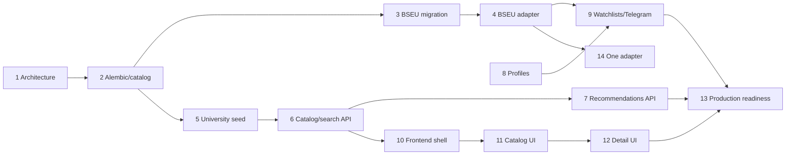

# Roadmap платформы «Куда поступать»

## Правила выполнения

- Один milestone выполняется за одну Codex-сессию и завершается одним осмысленным commit/checkpoint.
- Перед крупным этапом дерево чистое; после изменений выполняются `pytest`, `pytest -m live`, `ruff check .`, `npm run lint`, `npm run typecheck`, `npm run build` через `check.ps1`.
- Каждый data migration дополнительно проверяет backup/restore, row counts, `PRAGMA integrity_check` и `PRAGMA foreign_key_check`.
- Старый БГЭУ monitor остаётся работающим на каждом checkpoint. Production deployment и push выполняются только по отдельному явному запросу.
- Сроки и даты здесь намеренно не назначаются.

## 1. Architecture and migration design

- **Goal:** зафиксировать фактическую и целевую архитектуру, canonical data model, adapter boundary и безопасную последовательность преобразования.
- **In scope:** `platform-redesign.md`, `database-migration-plan.md`, `adapter-contract.md`, этот roadmap, пять ADR; read-only аудит production code/DB.
- **Out of scope:** модели, Alembic, API/frontend/adapters, DB writes, deployment.
- **Dependencies:** baseline `ready for redesign`, source audit, clean branch `feature/platform-redesign`.
- **Expected files/modules:** только `docs/*.md`, `docs/adr/*.md`; точечный `AGENTS.md` лишь при фактической ошибке.
- **Verification:** наличие/согласованность Markdown, отсутствие broken local references, секретов и незавершённых пометок, `check.ps1`, Git diff ограничен docs.
- **Completion criteria:** все решения и rollback gates описаны; отдельный docs commit; production code/SQLite unchanged.
- **Risk:** low (documentation), with medium design impact.

## 2. Alembic bootstrap and catalog schema

- **Goal:** подключить Alembic к существующей SQLite и создать additive catalog foundation без переноса snapshots.
- **In scope:** schema fingerprint/stamp strategy; migrations A and B; universities/categories/programs/offerings; constraints/indexes; fresh and existing DB tests.
- **Out of scope:** BSEU backfill, adapter extraction, catalog import, new public API/UI.
- **Dependencies:** milestone 1; verified backup/restore; clean legacy schema.
- **Expected files/modules:** `backend/alembic.ini`, `backend/alembic/`, model modules under `backend/app/models/`, database/core metadata wiring, migration tests, dependency files only as required for Alembic.
- **Verification:** upgrade fresh DB and copy of legacy DB; downgrade empty additive schema; schema/row-count/FK/integrity checks; old API and full `check.ps1`.
- **Completion criteria:** production-style legacy copy can be safely stamped/upgraded; no snapshot moved; old monitor is identical.
- **Risk:** high (first migration against existing DB).

## 3. BSEU data migration

- **Goal:** create canonical BSEU university/program/offering identity and map every existing BSEU row without data loss.
- **In scope:** migration C, `legacy_specialty_mappings`, source/run links, snapshot FK backfill, compatibility read tests.
- **Out of scope:** changing scraper ownership, new adapters, new public catalog API, historical cutoff import.
- **Dependencies:** milestone 2; explicitly verified admission year and source mappings.
- **Expected files/modules:** Alembic revisions, mapping model/repository, migration verification scripts/tests.
- **Verification:** before/after IDs/counts/hashes/JSON/timestamps, zero unmapped snapshots, exact old endpoint payload comparison, downgrade on disposable copy, `check.ps1`.
- **Completion criteria:** all legacy snapshots/runs/cache/fingerprints preserved and traceable to canonical BSEU offering; legacy writes still work.
- **Risk:** high (irreversible if mapping is guessed; therefore fail closed).

## 4. BSEU adapter extraction and registry

- **Status:** M-BSEU-ADAPTER-01 complete. GAP-01 from the final integration readiness audit is resolved: scheduled and manual BSEU refresh now share explicit registry-backed orchestration with parser, 304, Snapshot, ScraperRun, status and Telegram parity.

- **Goal:** extract BSEU source handling behind the documented adapter protocol and registry with behavioral parity.
- **In scope:** adapter DTOs/errors/capabilities, registry, shared HTTP conditional state, BSEU adapter, monitoring service orchestration, compatibility delegation.
- **Out of scope:** other universities, catalog UI, recommendation algorithm, removal of legacy endpoints/tables.
- **Dependencies:** milestones 2–3; adapter contract.
- **Expected files/modules:** `backend/app/adapters/`, `schemas/`, `services/monitoring*`, `repositories/source*`; existing modules retained as wrappers where needed.
- **Verification:** parser/live/HTTP/304/dedup/scheduler/manual refresh/Telegram parity tests, registry duplicate/unknown tests, full `check.ps1`.
- **Completion criteria:** production BSEU flow uses registry-backed service without payload or behavior regression; no university `if/elif` dispatch.
- **Risk:** high (core monitoring cutover).

## 5. Canonical university seed/import/audit

- **Status:** M-BSEU-PROGRAM-SOURCE-AUDIT-01 and M-BSEU-PROGRAM-IMPORT-01 complete: the active BSEU competition XML is audited as 77 offering rows; exactly 57 confirmed candidates were imported as 17 Program and 57 ProgramOffering identities. The existing Economic Informatics Program and paid Offering are reused without changing their IDs or relationships. All 20 `needs_review` rows remain unimported. The new Offerings are reference-only catalog data; no adapters, monitored sources, snapshots, scheduler registrations or Telegram monitoring were added.

- **Goal:** import the 47 audited canonical institutions with provenance and idempotent validation.
- **In scope:** validated import CLI/service, codes/slugs, aliases/review flags, source provenance, repeatable seed tests.
- **Out of scope:** deep research of unknown sources, program catalogs, new admission adapters, UI.
- **Dependencies:** catalog schema and `docs/universities-source-audit.md`.
- **Expected files/modules:** canonical import CLI, catalog repository/service, seed fixtures derived from tracked audited JSON, validation tests.
- **Verification:** exactly audited records, idempotent rerun, unique code/slug, source URL/checked time, no invented availability, `check.ps1`.
- **Completion criteria:** database catalog matches canonical audit and BSEU remains `online`; ambiguous branch/rename items remain explicitly reviewed.
- **Risk:** medium (data correctness/provenance).

## 6. Catalog and search API

- **Goal:** expose bounded catalog/search reads over SQLite.
- **In scope:** `/api/v1/universities`, detail/program/offering endpoints, filters, pagination, FTS5 detection and fallback, source freshness schemas.
- **Out of scope:** frontend catalog, recommendations, user profiles, modifying old endpoints.
- **Dependencies:** milestones 2 and 5; program data coverage sufficient for useful endpoints.
- **Expected files/modules:** API routers/schemas, catalog/search services/repositories, FTS migration if enabled, OpenAPI/API tests.
- **Verification:** query/filter/pagination/typo/fallback tests, explain/query-index checks, unknown/stale responses, old API regression and `check.ps1`.
- **Completion criteria:** stable versioned API returns only sourced facts and behaves acceptably with/without FTS5 on VPS-sized data.
- **Risk:** medium (query correctness/performance).

## 7. Recommendations API v1

- **Status:** M-RECOMMENDATIONS-01 complete: публичный `/recommendations` и `GET /api/recommendations` дают детерминированный подбор по фактически импортированным полям, разделяют monitored status, catalog match и insufficient coverage, интегрированы с явным profile-score action и не создают вероятность поступления. Нормализованная совместимость предметов и расширение данных остаются отдельным будущим scope. M-COMPARE-01 завершён отдельным срезом раздела 8.

- **Goal:** implement a deterministic, explainable first recommendation service using canonical offerings.
- **In scope:** request/output contract, required subject compatibility, filters/preferences, match/confidence/reasons/warnings/freshness, versioned API.
- **Out of scope:** ML/probability claims, frontend experience, account auth, fabricated completion of missing data.
- **Dependencies:** catalog/search API and adequate program/offering/subject data.
- **Expected files/modules:** recommendation schemas/service/repository queries, scoring policy configuration, tests and limitations docs.
- **Verification:** deterministic fixtures, strict unknown handling, stale/confidence warnings, boundary/performance tests, `check.ps1`.
- **Completion criteria:** every recommendation is explainable and source-backed; match score is never presented as admission probability.
- **Risk:** high (decision-support semantics).

## 8. Anonymous profiles, favorites and compare

- **Status:** M-MY-LIST-01 и M-COMPARE-01 complete: анонимный профиль хранит личный балл и сохранённые University/Program, а публичный `/compare` нейтрально сопоставляет 2–3 вуза по URL и существующему read-only catalog API без зависимости от профиля. Cross-device merge и аккаунты не реализованы; эти части M8 остаются открытыми.

- **Goal:** add privacy-conscious anonymous server profiles and optional cross-device state.
- **In scope:** signed HttpOnly cookie, public UUID, server preferences, favorites, compare decision/implementation if justified, localStorage merge contract.
- **Out of scope:** email/password login, Telegram linking, watchlist notifications, frontend redesign beyond integration needs.
- **Dependencies:** migration E user subset; versioned API conventions.
- **Expected files/modules:** profile models/migration, cookie/core security, profile/favorite/compare API/services/repositories, tests.
- **Verification:** cookie flags/signature, authorization isolation, cascade checks, merge/idempotency, no sequential IDs/secrets exposed, `check.ps1`.
- **Completion criteria:** anonymous profile survives sessions, owns only its data, and local fallback can merge without silent loss.
- **Risk:** high (privacy and authorization).

## 9. Watchlists and Telegram linking

- **Status:** M-WATCHLIST-01 и M-TELEGRAM-WATCH-01 complete: анонимный профиль может включить BSEU Program watch, видеть persisted event history, безопасно связать один Telegram chat и получать confirmed per-profile delivery с bounded retry/dedup status. M-RECOMMENDATIONS-01 и M-COMPARE-01 также завершены. Registered accounts, cross-device merge, production rehearsal и дополнительные adapters остаются незавершёнными.

- **Goal:** connect watched offerings and per-profile Telegram delivery while preserving owner mode.
- **In scope:** one-time hashed link tokens, Telegram accounts, watchlists, notification events/status/retry, fingerprint dedup, owner compatibility.
- **Out of scope:** global chat ID replacement, broad bot conversation UI, other channels, removal of `notification_logs`.
- **Dependencies:** milestones 4 and 8; notification part of migration E.
- **Expected files/modules:** linking/watchlist/notification models, APIs/services/repositories, Telegram callback/commands, scheduler job, security/dedup tests.
- **Verification:** token expiry/one-use/no raw storage, profile isolation, duplicate/retry/recovery tests, sanitised failures, owner-mode parity, `check.ps1`.
- **Completion criteria:** each delivery is attributable and deduplicated per profile/account; legacy owner delivery remains operational.
- **Risk:** high (security and duplicate external messages).

## 10. Frontend shell and homepage

- **Status:** M-MVP-PUBLIC-MONITOR-01 complete: публичный `/monitor` стал полностью read-only, показывает отдельные состояния автоматического сборщика и давности данных БГЭУ, а при отсутствии снимка предлагает только безопасный GET retry. Telegram UI теперь следует `telegram_enabled`: при выключенном feature form и challenge не создаются. Защищённый operator refresh и scheduler не менялись. M-COMPARE-01 из раздела 8 также завершён.

- **Goal:** introduce routed application shell and honest data-coverage homepage while preserving the existing monitor.
- **In scope:** router/layout/navigation, typed API layer/query state, `/`, `/monitor`, route states, provenance components, responsive foundation.
- **Out of scope:** full university/program detail pages, recommendations UI, replacing monitor behavior.
- **Dependencies:** catalog API shape; current dashboard parity requirements.
- **Expected files/modules:** frontend router/layout/API/query modules, homepage, monitor wrapper, shared state/error/provenance components.
- **Verification:** lint/type/build, route/base-path/Nginx behavior, 320px and desktop checks, keyboard states, monitor visual/functional parity, backend tests.
- **Completion criteria:** new shell works under root and configured base path; current dashboard remains accessible and complete.
- **Risk:** medium (frontend routing/deployment compatibility).

## 11. University catalog UI

- **Goal:** deliver searchable/filterable `/universities` experience.
- **In scope:** URL-backed search/filter/sort/pagination, cards/list, data status/provenance, loading/error/empty states, local recent filters if useful.
- **Out of scope:** program detail, recommendations, speculative ranking or unsourced visuals.
- **Dependencies:** milestones 6 and 10.
- **Expected files/modules:** university catalog route, filter components, query hooks, responsive styles/tests.
- **Verification:** URL round-trip, API error/offline handling, unknown/stale labels, responsive/keyboard checks, lint/type/build and full suite.
- **Completion criteria:** users can find confirmed institutions without false data or hidden provenance.
- **Risk:** medium (filter semantics/data honesty).

## 12. University and program detail UI

- **Status:** M-DETAIL-01 (public University detail vertical slice) and M-PROGRAM-DETAIL-01 (public Program detail vertical slice) are complete. Both are read-only and expose only imported coverage. M-READINESS-AUDIT-01 confirmed that section 13 remains gated by missing roadmap prerequisites; the selected next milestone is M-BSEU-ADAPTER-01 from section 4.

- **Blocking repair:** M-DEV-SAFETY-01 is complete: `start-dev.ps1` uses an explicit side-effect-free development mode before Program detail work begins.

- **Goal:** expose `/universities/:slug`, program listing and `/programs/:id` with normalized offerings.
- **In scope:** profile facts, offerings grouped by year/form/funding, tuition/scholarship/dormitory/media when sourced, source panels, favorite/compare hooks.
- **Out of scope:** inventing missing content, collapsing Program and ProgramOffering, treating current estimates as history.
- **Dependencies:** catalog UI/API, canonical program/finance data and profiles if favorite actions ship.
- **Expected files/modules:** detail routes/components/hooks, offering tables, provenance and availability views.
- **Verification:** grouping fixtures for the three normalization examples, unknown/partial/stale states, responsive/accessibility, full suite.
- **Completion criteria:** distinct offerings and histories are understandable; every material fact exposes provenance/freshness.
- **Risk:** medium-high (dense data semantics).

## 13. Final integration and production readiness

- **Status:** M-READINESS-AUDIT-01 is complete and its GAP-01/M4 prerequisite is now resolved by M-BSEU-ADAPTER-01. M-RECOMMENDATIONS-01 and the selected M9 watch/Telegram slices are complete, but the remaining M7 subject scope, unfinished M8 scope and production rehearsal/resource/operations gaps keep section 13 at **NO-GO**. See `docs/final-integration-readiness-audit.md`.

- **Goal:** harden the assembled first release for the existing low-resource VPS.
- **In scope:** integration regression, query/load budgets, backup/restore/migration rehearsal, Nginx/systemd/base path, privacy/log audit, operator docs, compatibility/deprecation review.
- **Out of scope:** destructive migration F unless separately approved, new admission adapters, infrastructure replacement.
- **Dependencies:** all selected first-release feature milestones.
- **Expected files/modules:** integration tests, health/readiness diagnostics, deployment/docs adjustments, performance fixtures.
- **Verification:** full suite, migration from production-like backup and rollback, one-worker scheduler check, memory/disk/query measurements, secret scan, deployment healthcheck.
- **Completion criteria:** documented go/no-go and rollback; no unresolved high-risk issue; old BSEU contract passes; production change still needs explicit user request.
- **Risk:** high (release integration).

## 14. One milestone per new admission adapter

- **Goal:** connect exactly one audited university source without weakening existing adapters.
- **In scope:** deep source audit, fixtures, capability declaration, adapter/parser, source seed/config, monitoring integration and institution-specific tests/docs.
- **Out of scope:** multiple universities, unrelated schema/UI redesign, unsupported capabilities, Playwright unless a one-off research exception is explicitly justified (never permanent runtime Playwright).
- **Dependencies:** registry/BSEU parity, canonical university record, dedicated source feasibility audit and official-source approval.
- **Expected files/modules:** one adapter module, fixtures/tests, source metadata update and focused documentation.
- **Verification:** offline fixtures, fail-closed schema tests, conditional/304/rate/error behavior, live test under explicit marker, regression for BSEU and full `check.ps1`.
- **Completion criteria:** adapter has truthful capabilities/provenance, bounded load and rollback/disable switch; one dedicated commit.
- **Risk:** high by default; reassessed per source stability.

Repeat milestone 14 independently for each new university. `candidate` in the source audit is not authorization to implement: every source first needs a dedicated technical audit.

## Dependency summary

Milestone 8 also depends on the user-profile subset of migration E, scheduled as part of that milestone rather than bundled into migration bootstrap. Work may be reordered only if dependencies and one-milestone-per-session boundaries remain explicit.
